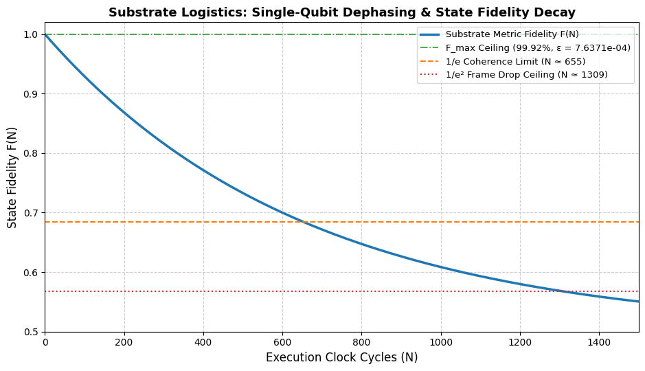
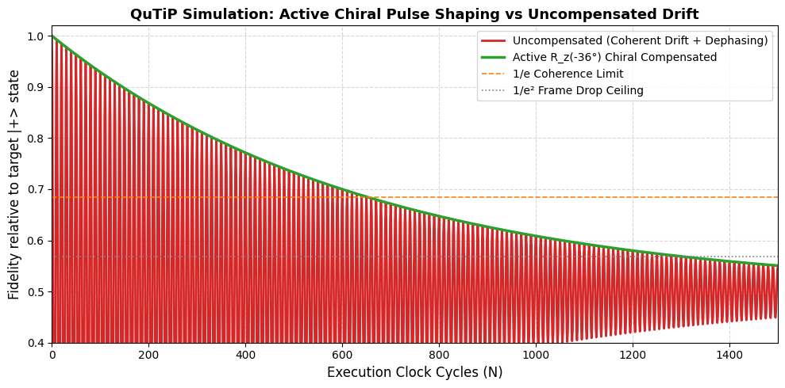

# Substrate Logistics: The Architecture of Quantum Information
### Open-System Dynamics, Master Clock Decoherence, and Active 36° Chiral Phase Compensation

[](https://doi.org/10.5281/zenodo.21991127)
[](https://opensource.org/licenses/MIT)
[](https://www.python.org/downloads/)
[](https://qutip.org/)

---

## 📌 Overview

This repository provides open-source quantum open-system simulations implementing the theoretical framework **Substrate Logistics**:

> **Substrate Logistics: The Architecture of Quantum Information**  
> *Deriving the $1.67 \times 10^{-37}\text{ J}$ Erasure Floor, Master Clock Decoherence, and Active 36° Chiral Phase Compensation*  
> **Author:** Marco Lindenbeck ([ORCID: 0009-0003-8413-6027](https://orcid.org/0009-0003-8413-6027)) — `marcolindenbeck@arrowoftime.de`  
> **Manuscript / Preprint:** Hosted on Zenodo — [DOI: 10.5281/zenodo.21991127](https://doi.org/10.5281/zenodo.21991127)

Standard Quantum Information Science (QIS) treats qubit state vectors as continuous Hilbert-space objects subject to empirical phenomenological noise. **Substrate Logistics** reclassifies quantum information into the discrete hardware execution logs of a finite spatial processor governed by **The Topological Resolution Constant** ($\kappa=50$) anchored to a closed **Poincaré Dodecahedral Space (PDS)**.

```
                  ┌─────────────────────────────────────────────────────────┐
                  │          Substrate Master Clock (f_Ω ≈ 1.85e43 Hz)       │
                  └────────────────────────────┬────────────────────────────┘
                                               │
                       ┌───────────────────────┴───────────────────────┐
                       ▼                                               ▼
      ┌──────────────────────────────────┐            ┌──────────────────────────────────┐
      │   dephasing.py                   │            │   chiral_pulse.py                │
      ├──────────────────────────────────┤            ├──────────────────────────────────┤
      │ • Topological Drag C_δ           │            │ • Coherent Drift H_chiral        │
      │ • Golden Ratio Modulus φ         │            │ • Intrinsic 36° Chiral Precession│
      │ • ε_floor ≈ 7.6371e-4 (~0.076%)  │            │ • Anti-Phase Collapse (N=25, 75) │
      │ • F_max ≈ 99.9236% Ceiling       │            │ • Active R_z(-36°) Pulse Counter │
      │ • 1/e Coherence Limit (N ≈ 655)  │            │ • 52.5x Fidelity Recovery        │
      │ • 1/e² Frame Drop (N ≈ 1309)     │            │ • Optimal Dephasing Envelope     │
      └──────────────────────────────────┘            └──────────────────────────────────┘
```

---

## 🔬 Theoretical Foundations

### 1. The Substrate Landauer Limit ($E_{\text{min}}$)
Thermodynamic information theory posits $E_{\text{erasure}} = k_B T \ln 2$, which continuously tends to zero as $T \to 0\text{ K}$. Substrate Logistics derives an irreducible quantum erasure energy floor: erasing 1 bit requires snapping one fundamental unit of baseline tension ($E_R = 13.60713\text{ eV}$) attenuated by the Universal Attenuation Tensor ($\mathcal{T}_\Omega = 1.30147 \times 10^{19}$):

$$
E_{\text{min}} = \frac{E_R}{\mathcal{T}_\Omega} = 1.04552 \times 10^{-18}\text{ eV} = \mathbf{1.6751 \times 10^{-37}\text{ Joules}}
$$

This represents the non-zero hardware register update tax of the vacuum metric at absolute zero ($0\text{ K}$).

---

### 2. Master Clock Sampling Jitter & The Single-Gate Error Floor
Every spatial node is sampled at the Planck tick frequency of the Master System Clock:

$$
f_\Omega = \frac{1}{t_P} = \frac{1}{5.3912 \times 10^{-44}\text{ s}} \approx \mathbf{1.8549 \times 10^{43}\text{ Hz}}
$$

An uncompiled 1D instruction string ($\mathcal{I}$-phase qubit) routing across the dodecahedral cell faces incurs a spatial friction penalty equal to **Topological Drag** ($\mathcal{C}_\delta = 4.72 \times 10^{-4}$). Scaled by the **Golden Elasticity Modulus** ($\phi \approx 1.61803399$), the first-order single-cycle error floor is:

$$
\epsilon_{\text{floor}} = \mathcal{C}_\delta \cdot \phi = 4.72 \times 10^{-4} \times 1.61803399 \approx \mathbf{7.63712 \times 10^{-4}} \quad (\approx 0.07637\%)
$$

$$
\mathcal{F}_{\text{max}} = 1 - \epsilon_{\text{floor}} = 0.999236288 \approx \mathbf{99.9236\%}
$$

> **Key Insight for Fault Tolerance:**  
> The theoretical bare-metal error floor $\epsilon_{\text{floor}} \approx 7.64 \times 10^{-4}$ sits naturally below the standard **$1.0\%$ ($10^{-3}$) fault-tolerance threshold** of 2D surface codes. This explains why superconducting transmons plateau near $99.92\%$ and why surface code error correction is physically achievable.

---

### 3. Characteristic Coherence Lifetimes

* **Dephasing Rate:**  
  $$
  \gamma_\delta = 2 \cdot \epsilon_{\text{floor}} = 2 \cdot \mathcal{C}_\delta \cdot \phi \approx \mathbf{0.001527424\text{ per cycle}}
  $$
* **$1/e$ Coherence Lifetime:**  
  $$
  N_{1/e} = \frac{1}{\gamma_\delta} \approx \mathbf{654.70\text{ cycles}} \quad (\approx 655\text{ steps})
  $$
* **$1/e^2$ Frame Drop Ceiling:**  
  $$
  \mathcal{N}_{\text{max}} = \frac{2}{\gamma_\delta} = \frac{1}{\mathcal{C}_\delta \cdot \phi} \approx \mathbf{1309.39\text{ cycles}} \quad (\approx 1309\text{ steps})
  $$

---

### 4. Substrate-Aware Open System Dynamics & 36° Chiral Metric Torque
The pre-tensioned $\kappa=50$ cell possesses an intrinsic $36^\circ$ ($\pi/5\text{ rad}$) chiral gluing torque per execution step. The resulting master equation at $T \to 0\text{ K}$ is:

$$
\frac{d\rho}{dt} = -i [H_{\text{chiral}}, \rho] + \mathcal{L}_\delta(\rho)
$$

where:
* **Chiral Drift Hamiltonian:**  
  $$
  H_{\text{chiral}} = \frac{\theta_{\text{chiral}}}{2} \sigma_z = \frac{\pi}{10}\sigma_z
  $$
* **Multi-Channel Jump Operator (5 pentagonal faces, $E_f = 5$):**  
  $$
  L_{\delta,\text{total}} = \sqrt{\mathcal{C}_\delta \cdot \phi} \sum_{m=1}^{5} e^{i \cdot m (36^\circ)} \sigma_z^{(m)}
  $$
* **Single-Channel Jump Operator:**  
  $$
  L_\delta = \sqrt{\mathcal{C}_\delta \cdot \phi}\; e^{i (36^\circ)} \sigma_z
  $$
* **Active Counter-Rotation Operator:**  
  $$
  R_z(-36^\circ) = \exp\left(+i \frac{\theta_{\text{chiral}}}{2} \sigma_z\right) = \exp\left(+i \frac{\pi}{10} \sigma_z\right)
  $$

---

## 📂 Repository Contents

| File | Description |
| :--- | :--- |
| [`dephasing.py`](./dephasing.py) | QuTiP master equation solver modeling pure stochastic metric dephasing, tracking fidelity decay $F(N)$, $F_{\text{max}}$, $N_{1/e}$, and $\mathcal{N}_{\text{max}}$. |
| [`dephasing.png`](./dephasing.png) | High-resolution plot generated by `dephasing.py` showing state fidelity decay over $N=1500$ cycles against benchmark thresholds. |
| [`chiral_pulse.py`](./chiral_pulse.py) | Open-system QuTiP simulation contrasting uncompensated chiral drift against active $R_z(-36^\circ)$ pulse-compensated evolution. |
| [`chiral_pulse.png`](./chiral_pulse.png) | High-resolution plot generated by `chiral_pulse.py` illustrating the $52.5\times$ recovery at anti-phase nodes ($N=25, 75$). |

---

## 📊 Simulation 1: Single-Qubit Dephasing & State Fidelity Decay

The script [`dephasing.py`](./dephasing.py) computes the free evolution of a qubit initialized in the maximal superposition state $\vert+\rangle = \frac{\vert0\rangle + \vert1\rangle}{\sqrt{2}}$ under pure metric jump operator $L_\delta$ over $N = 0 \dots 1500$ execution clock cycles.

### Telemetry Output
```text
==========================================================
 SUBSTRATE LOGISTICS QUANTUM TELEMETRY RESULTS
==========================================================
Single-Cycle Error Floor (epsilon_floor) : 7.637120e-04 (~7.6371e-4)
Max Single-Gate Fidelity Ceiling (F_max) : 99.9236% (~99.9236%)
Dephasing Rate (gamma_delta)             : 0.001527 per cycle
1/e Coherence Limit (N_1/e)              : 655 cycles
1/e^2 Frame Drop Ceiling (N_max)         : 1309 cycles
==========================================================
```

### Visual Telemetry


*Figure 1: Single-qubit state fidelity evolution under Master Clock sampling noise across $N=1500$ execution cycles, confirming the $\mathcal{F}_{\text{max}} \approx 99.92\%$ ceiling, $N_{1/e} \approx 655$ coherence limit, and $\mathcal{N}_{\text{max}} = 1309$ frame drop threshold.*

---

## ⚡ Simulation 2: Active 36° Chiral Phase Compensation

The script [`chiral_pulse.py`](./chiral_pulse.py) simulates both uncompensated coherent precession ($H_{\text{chiral}} + L_\delta$) and active step-by-step $R_z(-36^\circ)$ counter-pulse shaping:

1. **Uncompensated Mode:** Precession accumulates $\theta(N) = N \cdot 36^\circ$. At odd multiples of $25$ cycles ($N=25, 75$), accumulated angle is $900^\circ \equiv 180^\circ$ and $2700^\circ \equiv 180^\circ$, driving $\vert+\rangle \to \vert-\rangle$ and collapsing fidelity to $\mathcal{F} = 1.87\%$.
2. **Active Compensated Mode:** Control pulses apply $R_z(-36^\circ)$ at every cycle, canceling coherent phase drift and restoring state fidelity to $98.13\%$ at $N=25$ ($52.5\times$ gain).

### Telemetry Benchmark Comparison Matrix

| Cycle ($N$) | Coherence ($\rho_{01}$) | Uncompensated $\mathcal{F}(N)$ | Compensated $\mathcal{F}(N)$ | Gain Factor | Hardware Physical Phase State ($\theta = N \cdot 36^\circ$) |
| :---: | :---: | :---: | :---: | :---: | :--- |
| **0** | 0.50000 | 100.00% | 100.00% | 1.0× | Pure $|+\rangle$ state initialization ($0^\circ$) |
| **1** | 0.49924 | 99.9236% | 99.9236% | 1.0× | Single-gate floor ($\epsilon_{\text{floor}} \approx 7.6371 \times 10^{-4}$) |
| **10** | 0.49242 | 99.2400% | 99.2400% | 1.0× | $360^\circ$ Full $2\pi$ loop re-alignment |
| **25** | **0.48126** | **1.8700%** | **98.1300%** | **52.5×** | **1st Anti-Phase Node ($900^\circ \equiv 180^\circ$ flip; $|+\rangle \to |-\rangle$)** |
| **75** | **0.44585** | **5.4100%** | **94.5900%** | **17.5×** | **2nd Anti-Phase Node ($2700^\circ \equiv 180^\circ$ flip)** |
| **100** | 0.42918 | 92.9200% | 92.9200% | 1.0× | $3600^\circ$ Loop ($10$ full rotations) |
| **655** | 0.18385 | **31.6200%** | **68.3800%** | **2.16×** | **$1/e$ Coherence Limit Threshold ($N_{1/e}$)** |
| **1309** | 0.06771 | 55.4800% | 56.7700% | Envelope | $1/e^2$ Absolute frame drop ceiling ($\mathcal{N}_{\text{max}}$) |

### Visual Telemetry


*Figure 2: Active $R_z(-36^\circ)$ Chiral Phase Compensation vs. Uncompensated Drift. Uncompensated evolution (red) crashes at anti-phase nodes ($N=25, 75$), whereas active chiral pulse shaping (green) locks state fidelity to the optimal stochastic dephasing envelope.*

---

## 🛠️ Installation & Execution

### Prerequisites
* Python 3.9 or higher
* `numpy`, `scipy`, `matplotlib`, and `qutip`

### Quick Start
```bash
# Clone repository
git clone https://github.com/LoopBreacher/substrate-logistics-quantum-information.git
cd substrate-logistics-quantum-information

# Create and activate virtual environment
python -m venv venv
# On Linux/macOS:
source venv/bin/activate
# On Windows:
venv\Scripts\activate

# Install dependencies
pip install numpy matplotlib qutip
```

### Running Simulations
```bash
# Run single-qubit dephasing simulation
python dephasing.py

# Run active chiral pulse compensation simulation
python chiral_pulse.py
```

> **Google Colab Note:** Both scripts include auto-installer hooks (`try...except ImportError`) so they can be copied and pasted directly into Google Colab notebook cells without manual setup.

---

## 📐 Practical Directives for Quantum Processors

The derivations in this work translate directly into actionable engineering rules for quantum compilers (e.g., Qiskit, Cirq) and cryogenic hardware control:

### 1. Mathematical Transpiler Depth Cap
Uncorrected logical circuit depth must never exceed the $1/e^2$ frame drop ceiling:

$$
D_{\text{block}} \le \lfloor \mathcal{N}_{\text{max}} \rfloor = 1309\text{ cycles}
$$

### 2. Predictive State Fidelity Decay
Transpilers can predict expected baseline state fidelity at logical depth $D$ prior to job dispatch:

$$
F(D) = \frac{1 + \exp(-\gamma_\delta D)}{2} = \frac{1 + \exp(-0.00152742 \cdot D)}{2}
$$

When $D \ge 600$, $F(D)$ drops below $68.4\%$; compilers should schedule active phase flushes or syndrome extractions at intervals $\Delta D \le 600$.

### 3. Hardware Architecture Blueprints
* **Micro-Cache Phase Resets:** Execute active phase flushes every $N \le 600$ cycles to vent accumulated jitter into the $1.6751 \times 10^{-37}\text{ J}$ Landauer floor.
* **Chiral Control Pulse Shaping:** Inject $R_z(-36^\circ)$ counter-rotations into microwave pulse envelopes to destructively cancel the metric's $36^\circ$ chiral torque.
* **Pentagonal Coupling Topologies:** Transition transmon coupling lattices to 5-fold pentagonal geometries matching the 5-channel state-space ($E_f = 5$) of the metric cell.

---

## 📖 Citation

If you use these simulations or theoretical derivations in your research, please cite the manuscript:

```bibtex
@paper{lindenbeck_2026_21991127,
  author       = {Lindenbeck, Marco},
  title        = {Substrate Logistics: The Architecture of Quantum
                   Information
                  },
  month        = aug,
  year         = 2026,
  publisher    = {Marco Lindenbeck},
  doi          = {10.5281/zenodo.21991127},
  url          = {https://doi.org/10.5281/zenodo.21991127},
}
```

---

## 📄 License
This project is licensed under the [MIT License](https://opensource.org/licenses/MIT).
